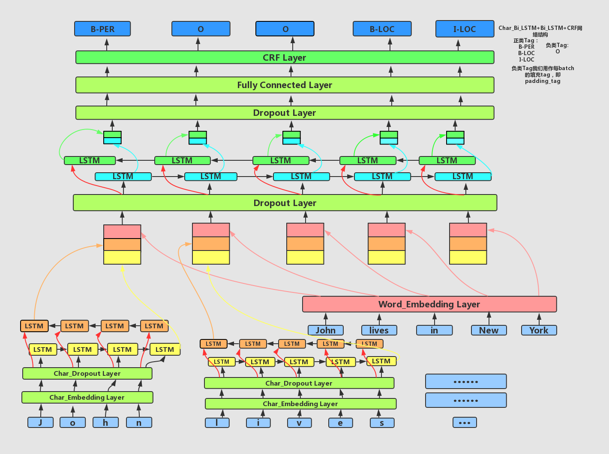
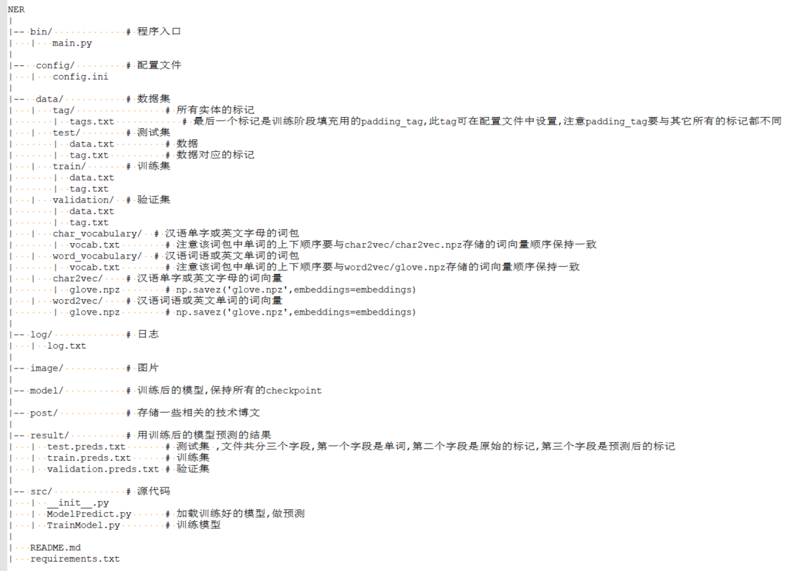

# 项目简介
本项目基于GitHub大神[guillaumegenthial](https://github.com/guillaumegenthial/tf_ner)的代码，是由其进一步改写而成的。这样，一方面是有助于自己学习总结要点，因此增加了很多代码注释；一方面也是为了给自己的工具库中再增加一些方便性的工具，便于以后可以快速试错。总之，一句话，**通过配置文件来控制模型！**这里感谢GitHub大牛们的无私奉献,受益良多!

***

# 项目用途
命名实体识别，词性标注等序列标注任务

# 项目中Char_BiLSTM+CRF网络结构

***

# 软件目录结构

***

# 如何使用

## 1. 训练自己的模型

### 1) 导入训练数据

1. 将自己的数据集切分成三份：`train`,`validation`,`test`，分别存储于`./data/train`,`./data/validation`,`./data/test`目录下。每份数据都包含两个文件:`data.txt`和`tag.txt`。

2. `data.txt`与`tag.txt`要一一对应，它们每行都存储一条数据。

3. `data.txt`存储单词序列，`tag.txt`存储Tag序列，并且单词之间以`一个空格分隔`，Tag同样，如下所示：

    `word1 word2 word3 word4 word5` 与 `tag1 tag2 tag3 tag4 tag5`

### 2) 导入训练数据的词包

我们需要将数据集中出现的所有类别的词放入到`./data/word_vocabulary/vocab.txt`中，格式是 每行一个词；将数据集中出现的所有类别的汉语单字或英文字母放入到`./data/char_vocabulary/vocab.txt`中，格式是 每行一个汉语单字或英文字母；

### 3) 如果导入外部词向量：char2vec or word2vec

外部词向量的构造方式是将训练好的词向量保存为`np.savez('glove.npz',embeddings=embeddings)`格式，便于后期查表，具体如下：

1. 构建一个列表，且名为`embeddings`
2. 按词包中单词的出现顺序，顺序读取每个单词向量各个维度的值，然后将每个单词各个维度的值存入到一个列表中，并将这个列表`append`到`embeddings`
3. 将列表`embeddings`保存为`np.array`类型，即`embeddings = np.array(embeddings)`
4. 然后保存词向量，即`np.savez('glove.npz',embeddings=embeddings)` ，参数`embeddings=embeddings`，等号左边的参数`embeddings`是我们自定义的参数，等号右边的`embeddings`是`3`中的`np.array`
5. 将压缩过的词向量`glove.npz`放入`./data/word2vec/glove.npz`中
6. 下面是导入到`ipython`中的`embeddings`的样例:

7. 修改配置文件
此时我们需要设置配置文件`./config/config.ini` `[params]`中的参数`if_load_word2vec=1`和`if_load_char2vec=1`，默认是导入外部词向量的。

### 4) 如果不导入外部词向量，通过模型自己训练词向量：char2vec or word2vec

此时我们需要设置配置文件`./config/config.ini` `[params]`中的参数`if_load_word2vec=0`和`if_load_char2vec=0`，默认是导入外部词向量的。如果不导入外部词向量，在训练时，我们尤其需要注意的是，`padding_tag`的向量我们应该始终保持为全0的状态，但由于`trainable=True`，模型自己构建的词向量要参与优化训练，因此无法保障`padding_tag`为全0的状态。因此在代码中，我们采用mask方法，具体做法是:

1. 构建一张`shape`与`embedding`查找表一致的，且元素仅为0和1的`tensor`表，我们命名为`mask_lookup_table`

2. `mask_lookup_table`只有在`padding_tag`索引位置对应的行的元素全为0外，其它元素都为1

3. 将输入的`input_ids`同时在这两张表中查找，得到两个`shape`一致的`tensor`,记为`embedding_vec`和`mask_vec`

4. 将这两个张量做点乘即可，即`embedding_vec = tf.multiply(embedding_vec,mask_vec)`

### 5) 导入Tag包

我们需要将单词序列对应的所有类别的Tag放入到`./data/tag/tags.txt`中，格式是 每行一个Tag。**注意这些Tag，我们默认都是正类别，即需要模型识别出的Tag，同时我们需要将负类别的Tag加入到该文件的末尾一行，一定是末尾一行！** 负类别的Tag，本项目是用作每batch数据的填充符号,因为BILSTM在训练时需要保持每batch中每条数据的长度都相同。因此，还需要在配置文件中设置一下，具体是修改`./config/config.ini` `[params]`中的`padding_tag`，切记，`padding_tag`一定要有别于其它正类别的Tag。

### 6) 如果还有其它要修改的，可以到配置文件中统一处理

即`./config/config.ini`

### 7) 开始训练模型

既可以通过运行`./bin/main.py`来训练，也可以运行`./src/TrainModel.py`来训练。

## 2. 加载自己的模型，开始预测

既可以通过运行`./bin/main.py`来预测，也可以运行`./src/ModelPredict.py`来预测。

## 3. 修改网络参数，构建个性化模型

你可以通过修改配置文件`./config/config.ini`来改变模型训练集的路径，网络参数，padding_tag，模型存储路径等等。

# 特别需要注意的是

如果之前训练时，没有用外部词向量训练，而此时想改为，导入外部词向量进行训练，那么你首先需要做的是清除`./model`文件中的所有数据，再开始重头训练，否则由于变量不一致，会报错！反之亦然！